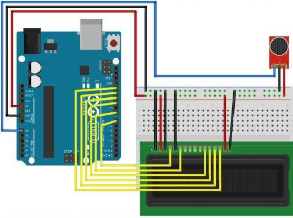
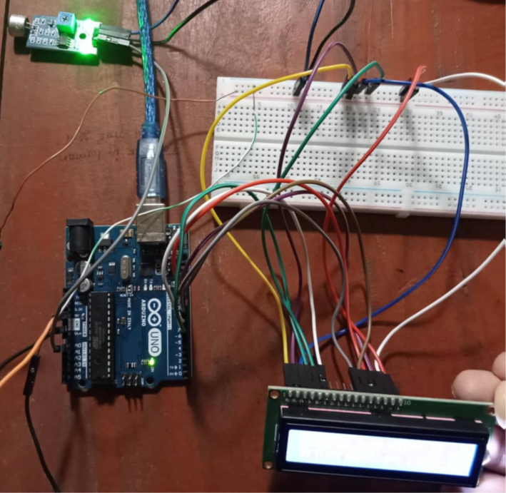
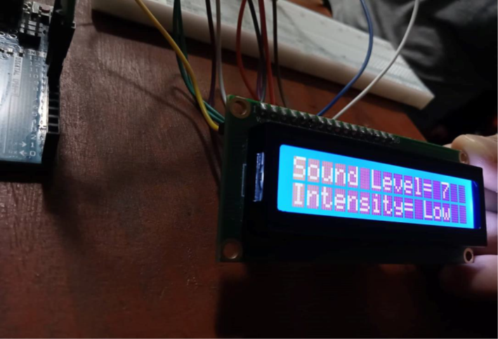
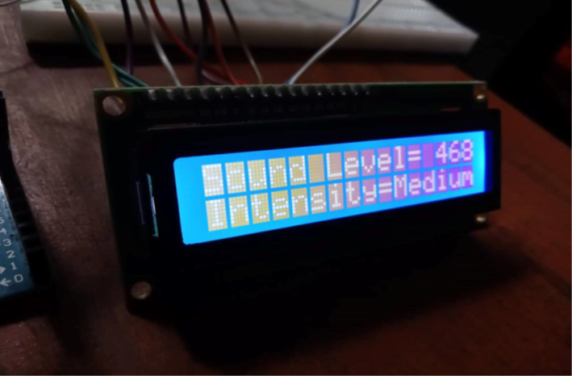
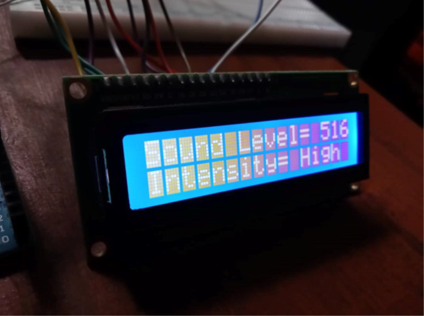

<h1 align="center">
Advanced Noise Level Detection and Monitoring
</h1>

## Project Overview
The Noise Level Detector is an Arduino-based project designed to measure and display the intensity of noise using a sound sensor module and a 16x2 LCD display. It provides a simple and cost-effective solution to monitor sound levels in various environments, making it suitable for applications in libraries, hospitals, and traffic control systems.

---

## Motivation
The motivation behind this project stems from the growing need to address noise pollution, a major public health and environmental concern. Excessive noise can have detrimental effects on human health, including stress, hearing loss, and decreased productivity. This project seeks to provide a reliable and efficient method to detect and monitor noise levels, ensuring that noise-sensitive areas such as hospitals, schools, libraries, and public spaces maintain an environment conducive to health, focus, and peace. By proactively detecting noise beyond acceptable limits, the system aims to aid in noise management and promote well-being in urban and community settings.


---

## Theory
The project utilizes an Arduino UNO and a sound sensor module. The sound sensor functions as a transducer, converting noise into an electrical signal (millivolts). This signal is processed by the Arduino, which then displays the noise level on an LCD screen, categorizing it as low, medium, or high intensity. 

---

## Required Components
- **Arduino UNO R3**
- **Sound Sensor Module**
- **16x2 LCD Display**
- **Jumper Wires**
- **Breadboard**
- **5V Power Supply**

---

## Circuit Diagram
<h1 align="center">
   
</h1>

---

## Procedure
1. **Component Connection**  
   All components were connected according to the circuit diagram.

   <h1 align="center">
      
   </h1>

2. **Code Upload and Power Supply**  
   The Arduino code was uploaded to the UNO board via a laptop, which also provided power.

3. **Sound Input Testing**  
   Different sound intensities were inputted to the sound sensor using a mobile phone, with results displayed on the LCD.

   <h1 align="center">
      
   </h1>

4. **Observing Results**  
   The variation in sound levels was observed and displayed on the LCD.

   <h1 align="center">
      
   </h1>

   <h1 align="center">
      
   </h1>

---

## Arduino Code
```c
#include <LiquidCrystal.h>

LiquidCrystal lcd(7,8,10,11,12,13);

int num_Measure = 128; // Set the number of measurements
int pinSignal = A0; // Pin connected to sound sensor module
int redLed = 5;
long Sound_signal;    // Store the value read from the sound sensor
long sum = 0;         // Store the total value of measurements
long level = 0;       // Store the average value
int soundlow = 40;
int soundmedium = 500;

void setup() {
  pinMode(pinSignal, INPUT); // Set the signal pin as input
  Serial.begin(9600);
  lcd.begin(16, 2);
}

void loop() {
  // Perform 128 signal readings
  for (int i = 0; i < num_Measure; i++) {
    Sound_signal = analogRead(pinSignal);
    sum += Sound_signal;
  }

  level = sum / num_Measure; // Calculate the average value
  Serial.print("Sound Level: ");
  lcd.print("Sound Level= ");
  Serial.println(level - 33);
  lcd.print(level - 33);

  if (level - 33 < soundlow) {
    lcd.setCursor(0, 2);
    lcd.print("Intensity= Low");
    digitalWrite(redLed, LOW);
  }
  if (level - 33 > soundlow && level - 33 < soundmedium) {
    lcd.setCursor(0, 2);
    lcd.print("Intensity= Medium");
    digitalWrite(redLed, LOW);
  }
  if (level - 33 > soundmedium) {
    lcd.setCursor(0, 2);
    lcd.print("Intensity= High");
    digitalWrite(redLed, HIGH);
  }

  sum = 0; // Reset the sum of the measurement values
  delay(200);
  lcd.clear();
}
```
## Project Challenges
1. **LCD Display Visibility**  
   One of the initial challenges encountered was the dimness of the LCD display, which made it difficult to read the measured values clearly. This could be improved with a better contrast adjustment or using a higher-quality display module.

2. **Sound Level Representation**  
   The project displayed the sound level as a voltage measurement (in millivolts) rather than a decibel (dB) level. This limited the precision of the readings for some applications. Incorporating a decibel meter for more accurate sound level measurement would enhance the project's functionality, though it was not included due to budget constraints.

---

## Applications
1. **Libraries**  
   The Noise Level Detector can be used in libraries to monitor and control noise levels, ensuring a quiet environment for readers.
2. **Hospitals**  
   This module can be utilized in hospitals, particularly in Intensive Care Units (ICUs) or other sensitive areas, to maintain a quiet and controlled environment.
3. **Traffic Control**  
   In traffic systems, the module could be employed to detect excessive honking and potentially reduce noise pollution through automated interventions.

---

## Discussion and Conclusion
The main objective of the project was to familiarize ourselves with the capabilities of an Arduino microcontroller and demonstrate its application in real-world scenarios. This project successfully showcased a simple yet effective way to detect noise levels using a sound sensor, with results displayed on an LCD screen. The Noise Level Detector categorized sound intensities into low, medium, and high, fulfilling all the initial objectives.

Moving forward, enhancements such as integrating a decibel meter and improving display visibility could make this solution more robust and versatile for different noise monitoring applications.
